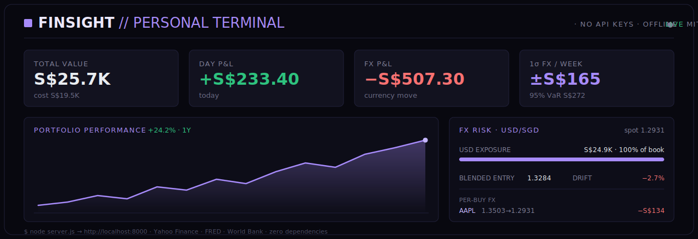

<div align="center">


<h1>FinSight <sub>// personal terminal</sub></h1>

<p><b>A free, Bloomberg-style portfolio terminal that runs entirely on your own machine.</b><br>
Live market data, FX-risk tracking, and an economic calendar — no accounts, no API keys, no build step.</p>

<p>


</p>

<p>
<a href="#-quick-start">Quick start</a> ·
<a href="#-features">Features</a> ·
<a href="#-fx-risk--macro">FX risk &amp; macro</a> ·
<a href="#-themes--fonts">Themes</a> ·
<a href="DOCS.md">Developer docs</a>
</p>

</div>

---

## ✨ Why FinSight

A personal trading terminal that's **small, hackable, and 100% free** — inspired by the Bloomberg-terminal idea but rebuilt as a ~250 KB zero-dependency web app you run locally. Your portfolio lives in a single `data/portfolio.json` on your machine and **never leaves it**. No sign-up, no paid feeds, no telemetry — just `node server.js` and a browser tab.

It's built for the investor who **funds in one currency and invests in another** (e.g. convert SGD → USD to buy US stocks): it separates how much of your return came from the **stock moving** vs the **currency moving**, and gives you a real **FX-risk cockpit**.

<div align="center"></div>

## 🚀 Quick start

> Requires **Node.js 18+** (no `npm install` — there are no dependencies).

```bash
git clone https://github.com/tanueihorng/finsight.git
cd finsight
node server.js
```

Then open **http://localhost:8000**. On a Mac you can also just double-click **`start.command`**.

A first-launch wizard sets your name + base currency and lets you **import a broker CSV**, add holdings manually, or start empty. Non-technical friend? Point them at **[START-HERE.md](START-HERE.md)**.

<details>
<summary><b>Import your holdings from a spreadsheet (CSV)</b></summary>

Click **IMPORT** in the Positions panel and paste/choose a file. Minimal format (header optional, column names matched loosely; add a `date` column to capture purchase-time FX):

```
symbol,quantity,avg_price,date
AAPL,10,195.50,2024-06-03
D05.SI,200,38.20
0700.HK,100,400
```

Or drop in a raw **Interactive Brokers / moomoo / Tiger** statement — FinSight detects the holdings (and, for IBKR, your dividend history). **EXPORT** downloads your current holdings with live value in your base currency.
</details>

## 🧩 Features

| | |
|---|---|
| 📊 **Portfolio tracking** | Add/sell/average positions; live quotes, P&L, day change, weights |
| 🌐 **Base-currency roll-up** | Hold USD/HKD/EUR stocks, see everything in your currency (default SGD) |
| 💱 **Stock vs FX P&L** | Split every gain into *price move* vs *currency move* |
| 🛡️ **FX risk panel** | USD exposure, blended entry rate, per-buy FX, realized FX, what-if slider, 1-week VaR |
| 📅 **Economic calendar** | Next Fed decision + dot-plot, plus this week's CPI / PCE / jobs / GDP |
| 🏦 **Macro panels** | FRED (CPI, Core PCE, Fed funds, yields), World Bank, VIX, world markets |
| 📈 **Interactive charts** | Candles/line/area, SMA/EMA/Bollinger, RSI, MACD, volume, drawing tools |
| 🧮 **Analytics** | Performance over time, allocation donut, sector heatmap |
| 📥 **Broker import** | Interactive Brokers / moomoo / Tiger statements, or plain CSV |
| 💵 **Dividend tracking** | Income received, trailing-12-month total, per-holding breakdown |
| 🔔 **Price alerts** | Desktop notification + toast + beep, even when the browser is closed |
| 🎨 **Themes & fonts** | Switch accent palette and font; remembered per browser |
| 🔒 **PIN lock** | Hashed PIN with brute-force throttling; the data API stays locked |
| 🗂️ **Multiple accounts** | Separate portfolios (IBKR / Crypto / SGX…) + an All-Accounts view |
| ⚙️ **Configurable layout** | Choose & reorder cards and panels; drag the ⠿ grip to rearrange |

## 💱 FX risk & 📅 macro

Because you fund in SGD but hold USD stocks, part of your gain/loss is the **stock price** moving and part is the **exchange rate** moving. FinSight makes that explicit.

**FX RISK panel**
- **Exposure** — how much of your book (in base currency) rides on USD, plus the USD notional.
- **Blended entry** — your weighted-average USD/SGD cost vs live **spot** and the **drift** between them.
- **FX P&L** — gain/loss from currency alone (open positions) + **realized FX** on closed trades.
- **Per-buy FX history** — one row per purchase: USD/SGD then vs now → the S$ you've won/lost on FX alone.
- **What-if slider** — drag a USD/SGD shock (±%) for the live impact on your book.
- **1-week FX VaR** — a 1σ weekly move and a 95% value-at-risk from recent USD/SGD volatility.

**ECON CALENDAR panel** — the next **Fed rate decision** and **dot-plot (FOMC SEP)** date (always shown, from the Fed's published schedule), plus this week's high-impact **CPI / PCE / jobs / GDP** releases with forecast vs previous, in your local time.

<details>
<summary><b>How the FX math works (and its limits)</b></summary>

Each buy/sell records the **exchange rate at that moment** (per lot), so your true cost basis is what you actually paid. `UNREALIZED = STOCK P&L + FX P&L`. Back-date a holding (a `date` column on import, the +ADD date box, or `ADD AAPL 10 195.50 2024-01-15`) and FinSight fetches the **historical** rate so the split is accurate.

- Buys newer than ~7 days show ~0 FX P&L by design (the rate hasn't moved yet — shown as "settling").
- Imported lots without a purchase date fall back to today's rate; add a date to backfill the true entry FX.
- VaR sums per-currency risk (conservative; exact for a single foreign currency).
</details>

## 🎨 Themes & fonts

Open **⚙ Layout** to switch the look — four accent palettes (**Violet** default, **Amber** for the classic Bloomberg feel, **Teal**, **Phosphor** green) and the font (**Mono / Sans / Serif**). All system fonts, so it stays offline. Your choice is remembered in the browser.

## 🗂️ Commands

Type in the top command bar:

| Command | What it does |
|---|---|
| `ADD AAPL 10 195.50` | Buy/add 10 AAPL at avg 195.50 (averages in if held) |
| `SELL AAPL 5 [price]` | Sell 5 AAPL (records realized P&L; price optional → market) |
| `DEL AAPL` | Remove AAPL from tracking |
| `Q TSLA` / just `TSLA` | Pull up a security's detail + chart + news |
| `WATCH NVDA` / `UNWATCH NVDA` | Add / remove from the watchlist |
| `ALERT AAPL > 320` | Alert when AAPL crosses a target (`<` for below) |
| `NEWS TSLA` · `MKT` · `HELP` | News for a symbol · refresh markets · help |

<details>
<summary><b>Symbol formats (Yahoo)</b></summary>

US: `AAPL` · Indices: `^GSPC` `^DJI` `^IXIC` `^VIX` · FX: `EURUSD=X` `USDSGD=X` · Crypto: `BTC-USD`
Commodities: `GC=F` (gold) `CL=F` (oil) · Non-US suffixes: `0700.HK` `D05.SI` `BMW.DE` `RELIANCE.NS`
</details>

## 🔌 Data sources &nbsp;·&nbsp; ⚠️ disclaimer

All free, no key:

| Source | Used for |
|---|---|
| **Yahoo Finance** | Quotes, history, search — stocks, indices, VIX, FX, crypto, commodities |
| **FRED** | US Fed data: Treasury yields, CPI, PCE, Fed funds, unemployment |
| **World Bank** | Macro indicators by country |
| **Forex Factory** | This-week economic-calendar events (CPI/PCE/jobs/FOMC) |

> [!IMPORTANT]
> **Not affiliated** with Bloomberg, Yahoo, Interactive Brokers, Forex Factory, or the Federal Reserve. "Bloomberg-style" describes the look only. The code *fetches* public endpoints for your own personal, local use — it does **not redistribute** any provider's data, and you shouldn't either. **FRED**/**World Bank** are open data; **Yahoo** is an unofficial endpoint (a common grey area — expect occasional rate-limiting); **Forex Factory's** feed is free for **personal use only — don't rebroadcast it**. Nothing here is financial advice; data is "as is" with no warranty.

## 📁 Project structure

```
finsight/
├── server.js              # Zero-dependency Node backend (API proxy + store + alerts)
├── start.command          # Double-click launcher (macOS)
├── DOCS.md                # Developer docs: architecture, config, full API reference
├── data/                  # Your data — git-ignored, never leaves your machine
│   └── portfolio.json
└── public/
    ├── index.html         # Terminal UI
    ├── styles.css         # Themeable dark "terminal" styles
    ├── chart.js           # Self-contained canvas trading chart
    └── app.js             # Frontend logic
```

> **Developers:** see **[DOCS.md](DOCS.md)** for architecture, env-var config, and the full HTTP API reference.

## 📄 License

[MIT](LICENSE) — free to use, modify, and share. Built for personal portfolio tracking, **not investment advice**.

<div align="center"><sub>Made for people who fund in one currency and invest in another.</sub></div>
